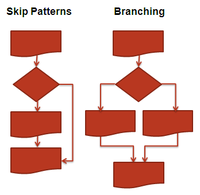
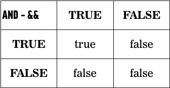

Intro to Javascript

---


Gauge skill level

Understand at a high-level how the web works, the role of the browser and where the industry is going: the rise and importance of mobile and how the web and JavaScript fit into this


Define the role of HTML, CSS, and JavaScript in web pages and web applications

Q: What is HTML? A: The content
Q: What is CSS? A: The visual layer
Q: What is Javascript? A: The interactive layer


Define the DOM and JavaScript's importance in using it to create rich web applications

Q: What is the DOM?
A: The Document Object Model. The HTML you write is parsed by the browser and turned into the DOM. In a lot of cases the visual representation of the DOM will be identical to your HTML. We can use javascript to alter the DOM on the fly. **Show innerHTML change on bootstrap.com**


Understand how programming languages work, their relationship to the machine on which the language is run


Understand and apply programming fundamentals using JavaScript: basic data types, arithmetic, conditional statements, iteration (loops), functions, arrays and objects

Define Variables
Show Math
Describe Conditionals
Show Loops
Show functions
Show Arrays
Explain Objects


Understand basic best-practices in software engineering at a high level


Build a complete, working HTML5 web application by building a professional swipe gallery/media carousel from scratch

---

##Variables

* We can tell our program to remember values for us to use later on.

* The action of saving a value to memory is called assignment

* The entity we use to store the value is called a variable

* The action of getting the value from a variable is called accessing the variable

---

##Variables & Data Types

What can you store in a variable?

--

##Data Types

Some of the types of values we support include:

* __String__ text
* __int__, __float__ numbers
* __Boolean__ true or false

---


##Strings

* Stores textual information
* String literal is surrounded by quotes
<br/><br/>
```'How is the weather today?'```
<br/><br/>

Single quotes are considered best practice.

--

##Strings

Double vs single quoted strings:

'They "purchased" it'

"It's a beautiful day"

--

##Strings
Escaping
"They \"purchased\" it"

'It\'s a beautiful day'

---

##Numbers

Represent numerical data

int:         42

float:      3.14159265

---


##Arithmetic In JavaScript


---

##Conditionals



---

##Making Decisions

It's either TRUE or FALSE (booleans)

If your age is greater than 18 you are an adult

```
  if (age > 18){
    document.write("You are an adult");
  }
```

---

##Conditional Syntax

```
if(condition is true) {
  //Do cool stuff
}
```

--

##Conditional Syntax

```
  if(condition is true) {
    //Do cool stuff
  }else{
    //Do other cool stuff
  }
```

--

##Conditional Syntax

```
  var topic = "JS";

  if (topic == "JS") {
    console.log("You're learning JavaScript");
  }
  else if(topic == "JavaScript") {
    console.log("You're still learning JavaScript");
  }
  else {
    console.log("You're learning something else");
  }
```

---

##Multiple Conditions

```
if (name == "GA" && password == "YellowPencil"){
  //Allow access to internet
}
```

---


##The Truth Table

```
if (name == "GA" && password == "YellowPencil"){
  //Allow access to internet
}
```

--

##The Truth Table



--

##The Truth Table

```
if (day == "Tuesday"  || day == "Thursday"){
  //We have class today
}
```

--

##The Truth Table


---

##Good night!


